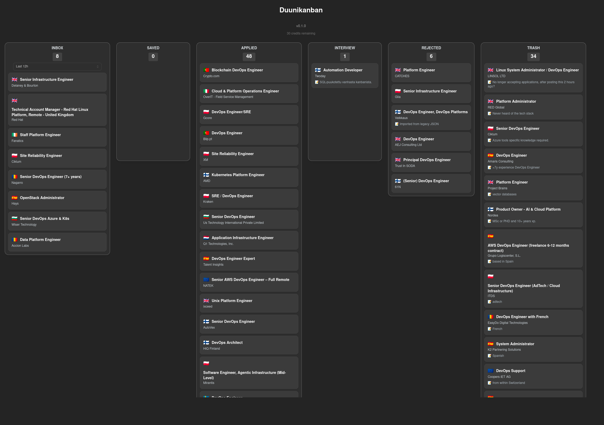

# Duunikanban — Job Listings Kanban

> Duunikanban is a job hunting tool that fetches listings from the [TheirStack](https://theirstack.com) API and stores them in a SQLite database. It provides a simple Kanban-style UI to organize your applications. Compared to e.g. LinkedIn's job search Duunikanban filters out non-english remote jobs, promoted jobs, fake remote jobs and you can set your coordinates and a distance in km to filter onsite jobs. In my case I get around 500 job listings a day searching and filtering via LinkedIn, but with Duunikanban I currently get about 20 - 30 jobs a day.



---

## Features

- Fetch job listings (Finland and EMEA region)

- Job metadata stored locally (title, company, location, posting URL, etc.)

- Kanban workflow:

  - Inbox

  - Saved

  - Applied

  - Interview

  - Rejected

  - Trash

- Job detail page with notes, and buttons for saving, applying or trashing the job listing.

- Filtering inbox by time range (last 12h, 24h, 48h, 7 days)

- Self-contained SQLite storage

- Docker based deployment

---

## Tech Stack
- Backend:	FastAPI, Python, SQLModel, SQLite
- Frontend:	React, Vite, Mantine UI
- API Source:	TheirStack
- Deployment:	Docker Compose

---


## Getting Started

1. Clone the repo
2. Sign up for TheirStack [here](https://app.theirstack.com/signup) and get your API key.
3. Set environment variables in .env file:

```
HOME_LAT=62.2426
HOME_LON=25.7473
THEIRSTACK_API_KEY=your-api-key
```

4. Check the variables in the docker-compose.yml file:

```
VITE_API_URL=http://<your-docker-host>:8000
```

5. Currently settings are still hardcoded in fi_jobs.py and emea_jobs.py, like what jobs we actually search for, distance from home and dealbreaker phrases in job descriptions.
TheirStack API docs are useful for customizing the search. Link [here](https://api.theirstack.com/#tag/jobs/POST/v1/jobs/search)

6. Run `docker-compose up -d` to start the app
7. Open http://localhost:3000 in your browser
8. May the odds be ever in your favor.

---


## Roadmap
- [x] Kanban UI: v0.1.0
- [ ] Config file for settings v0.2.0
- [ ] Timers for stale jobs: v0.2.0
- [ ] Multiple users & SaaS: v0.2.0
- [ ] Tool for manually filling kanban cards: v0.2.0
- [ ] Google calendar integration for all those job interviews: v0.3.0
- [ ] Kubernetes & hybrid cloud deployment: v1.0.0
- [ ] AI integration for automatic job applications v2.0.0
- [ ] Monetization era v3.0.0:
  - [ ] Allow companies to bypass filters and fill your inbox with their dream opportunities.
  - [ ] AI generated jobs that are actually ads.
  - [ ] 🚀🚀🚀 IPO 🚀🚀🚀
  - [ ] Acquired by Microsoft, there's now a kanban in LinkedIn


## License
Duunikanban is licensed under the AGPLv3 License.
